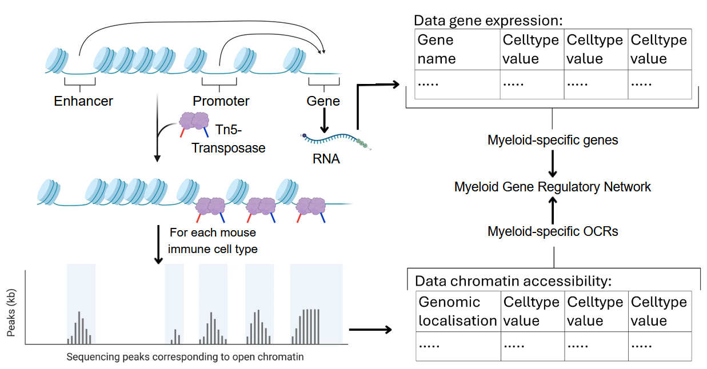
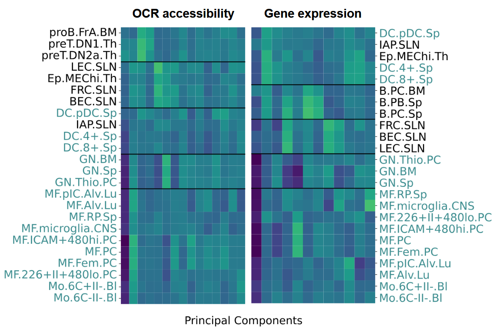
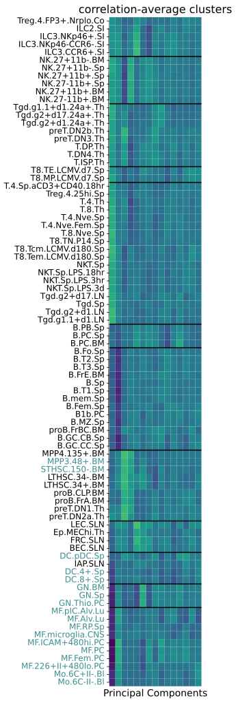
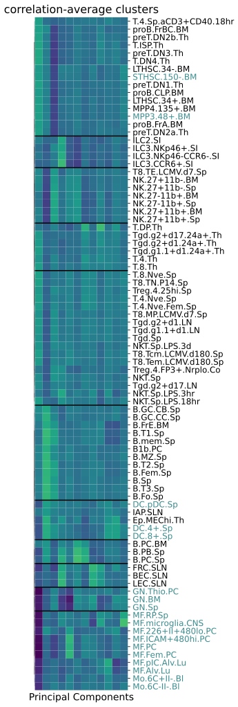
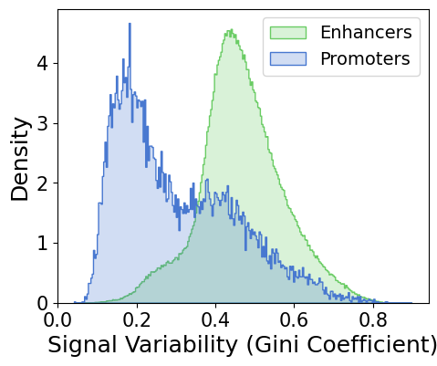
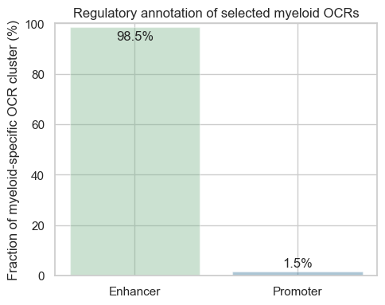
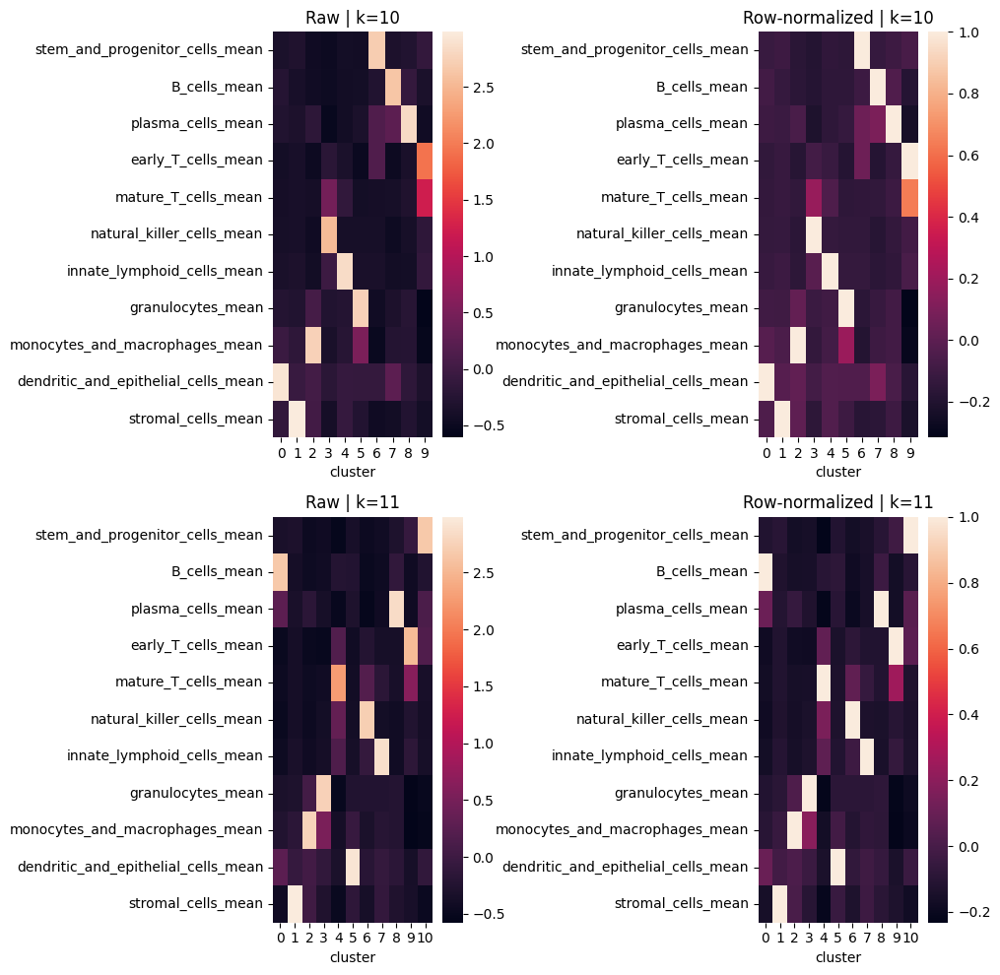
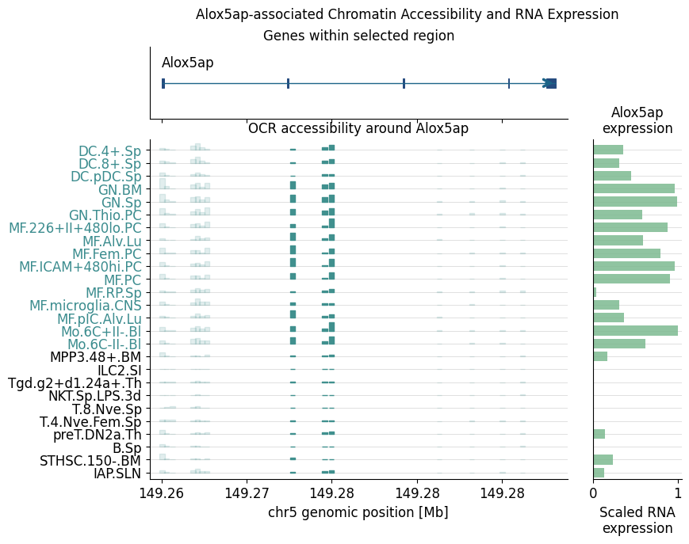
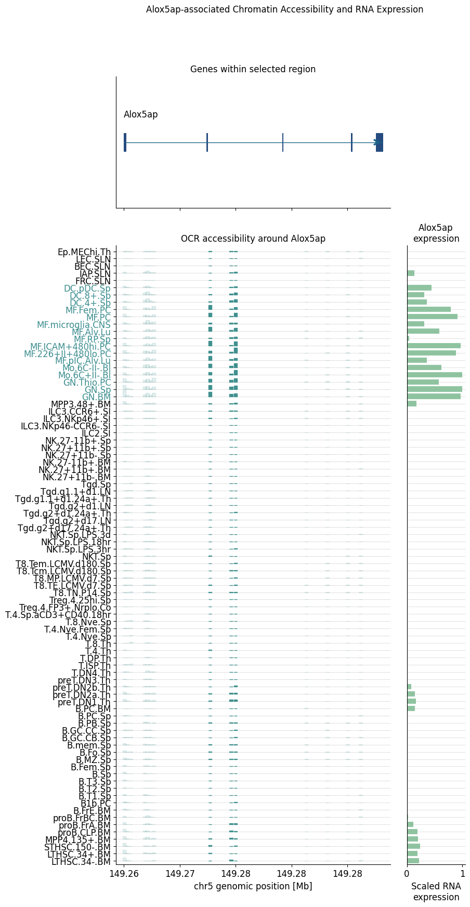
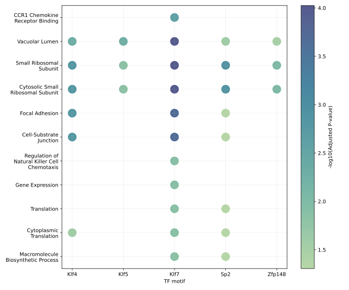

# group04_team05_poster_qr_code

topic04_team05

# ATAC-ing Myeloid Cell Identity

**Gene Regulation of Immune Cells · Topic 4.5**

Jordan, E. · Karlein, J. · Reisert, M. · Schreiber, J.  
Supervisor: Dr. Alexander Sasse

Bachelor Molecular Biotechnology · IPMB  
Data Analysis Project · Summer Semester 2026

## Table of Contents

- [Introduction](#introduction)
- [Methods](#methods)
- [Results](#results)
  - [PC-based clustering captures consistent cell lineages](#pc-based-clustering-captures-consistent-cell-lineages)
  - [Variable enhancers dominate myeloid-specific OCRs over promoters](#variable-enhancers-dominate-myeloid-specific-OCRs-over-promoters)
      - [Signal variability of promoters and enhancers](#signal-variability-promoters-enhancers)
      - [Myeloid-specific OCR enrichment](#myeloid-specific-ocr-enrichment)
  - [Cell-type-derived gene clusters reflect lineage-specific functions](#cell-type-derived-gene-clusters-reflect-lineage-specific-functions)
  - [Myeloid-specific OCR accessibility drives Alox5ap expression](#myeloid-specific-ocr-accessibility-drives-alox5ap-expression)
  - [Myeloid-associated TF motifs link to immune functions](#myeloid-associated-tf-motifs-link-to-immune-functions)
- [Key Highlights & Findings](#key-highlights--findings)
- [Future Directions](#future-directions)
- [References](#references)

<h2>Introduction</h2>

Although immune cells share the same genomic sequence within an organism, they differ strongly in morphology and function. In mice, as in humans, this diversity includes lymphoid and myeloid lineages with distinct cellular identities [[1]](#ref-1). Despite the vital importance of a functional immune system for the organism, critical gaps remain in our understanding of the differentiation cascade from hematopoietic stem cells into mature immune cells. 

Traditionally, cellular identities have been characterized by analyzing the transcriptome via RNA sequencing. However, transcriptomics alone captures only the output of cellular decision-making and misses the upstream regulatory mechanisms. With the development of Assay for Transposase-Accessible Chromatin (ATAC)-sequencing, it has become possible to investigate the epigenome by genome-wide profiling of open chromatin regions [[2]](#ref-2). 

A major milestone was achieved by Yoshida *et al*. who systematically paired ATAC-seq with RNA-seq data across 86 immune cell populations from mice [[3]](#ref-3). Using the mouse immune-cell regulatory atlas by Yoshida *et al*., we integrated chromatin accessibility, transcription factor (TF) activity, and gene expression to better understand the regulatory basis of myeloid differentiation and possible discover edges and nodes of a gene regulatory network, driving myeloid differentiation.

<h2>Methods</h2>

We analyzed matched chromatin-accessibility and gene-expression data from the mouse immune-cell atlas generated by Yoshida *et al.*, which contains data from 86 primary immune cell types. In this atlas, ATAC-seq and RNA-seq were performed for each cell type, allowing the joint analysis of open chromatin regions (OCRs) and transcriptional profiles.

  

ATAC-seq identifies accessible chromatin using a hyperactive Tn5 transposase, which preferentially fragments DNA and inserts sequencing adapters in open chromatin regions. After amplification and sequencing, this generates genome-wide OCR maps for each immune cell type. RNA-seq provides the corresponding gene-expression profiles, allowing chromatin accessibility to be compared with transcriptional activity across the same cell types.

For downstream analysis, chromatin-accessibility values for each OCR were assembled into an OCR-by-cell-type matrix, while gene-expression values were arranged into a corresponding gene-by-cell-type matrix. Restricting both datasets to shared cell types enabled the direct comparison of regulatory potential (represented by OCR accessibility) and transcriptional output (represented by gene expression) across the immune-cell panel.

<strong>Methodological details for QC and data cleanup of the Yoshida <em>et al.</em> dataset</strong>

Relevant notebooks:

<ul>
  <li>
    <a href="scripts/1.1%20Quality%20control.ipynb">QC</a>
  </li>
  <li>
    <a href="scripts/apply_new_blacklist.ipynb">Blacklist</a>
  </li>
</ul>

The QC metrics reported by Yoshida *et al.* fulfilled typical requirements for ATAC-seq read quality [[4]](#ref-4), and we therefore did not exclude any cell types based on QC criteria. However, since a newer version of the genomic blacklist was available, we applied this updated blacklist and removed 3,908 additional high-signal regions from the OCR set.

For all analyses integrating chromatin accessibility and gene expression, we restricted the dataset to cell types that were present in both the ATAC-seq and RNA-seq data. This ensured that OCR accessibility and gene-expression patterns could be compared directly across the same set of cell types.

Finally, downstream OCR–gene association analyses were restricted to genes that were present in the ATAC-seq annotation of nearby genes. Some gene identifiers in the RNA-seq file appeared to be inconsistent with the ATAC-seq annotation, and at least one entry, the gene labelled `"a"` near the end of the alphabetically sorted file, likely represents an annotation or parsing artifact. We therefore used the overlap between RNA-seq genes and ATAC-seq-annotated nearby genes as a conservative gene set for downstream integration.

<h2>Results</h2>

<h3>PC-based clustering captures consistent cell lineages</h3>

Relevant Notebooks:
* [OCR-based clustering](scripts/1.3_Cell_type_clustering.ipynb)
* [Gene expression-based clustering](scripts/2.1%20BasedOn1.3ConsistencyBetweenModalities.ipynb)

Our goal of identifying OCRs and genes involved in myeloid differentiation relies on the central assumption that myeloid cells — and, more broadly, related immune cell types — occupy similar regions in OCR accessibility and gene-expression space. To test this assumption, we first performed unsupervised clustering of cell types and qualitatively compared the resulting clusters with known biological lineages.

As an initial dimensionality-reduction approach, we used principal component analysis (PCA) on OCR accessibility and gene-expression profiles. Across K-Means clustering with different initializations, UMAP visualizations, and hierarchical agglomerative clustering with different distance metrics and linkage methods, the resulting cell-type clusters were remarkably stable.

<strong>Methodological details for our cell type clustering</strong>

To assess whether cell types grouped according to known biological lineages, we performed unsupervised clustering separately on OCR accessibility and gene-expression data. In both modalities, only cell types present in both the ATAC-seq and RNA-seq datasets were retained, allowing direct comparison between accessibility-based and expression-based clustering.

For the OCR-based analysis, we first used all OCRs that passed the systematic analysis filter from *Yoshida et al.* to reduce noise. After an initial PCA, the major lineage structure was already visible, although some overlap remained between myeloid and non-myeloid cell types. Since many OCRs showed very low variance across cell types, we removed low-variance OCRs and retained the most variable OCRs for downstream clustering. This largely preserved the previously observed structure while reducing the dimensionality of the input matrix.

Cell types were then represented in principal component space. We applied several complementary clustering approaches. 

First, K-Means clustering was performed across a range of cluster numbers, and candidate values of k were evaluated using silhouette scores and biological interpretability. We additionally used UMAP as a qualitative visualization to assess whether the observed grouping was also visible in a nonlinear two-dimensional embedding.

Second, we performed hierarchical agglomerative clustering in PC space. Different distance metrics and linkage methods were compared, including Euclidean, correlation, cosine, and cityblock distances combined with average, complete, or single linkage. Clustering quality was evaluated using silhouette scores across multiple values of k. Since silhouette scores alone do not guarantee biological interpretability, we further inspected the dendrograms and cluster assignments of the best-performing methods, focusing on biologically reasonable values of k and on the placement of known immune lineages, especially myeloid-associated cell types.

For the OCR-based clustering, correlation distance with average linkage provided a biologically coherent and comparatively fine-grained representation of the cell-type relationships. We therefore used the correlation-average solution as the basis for defining related cell-type groups in downstream OCR analyses. Plasmacytoid dendritic cells were treated as a separate group because they showed unstable placement across K-Means, UMAP, and alternative hierarchical clustering configurations.

The gene-expression-based analysis followed the same general workflow to test whether transcriptomic cell-type relationships were consistent with the OCR-based structure. PCA, K-Means clustering, UMAP visualization, and hierarchical clustering were applied to the RNA-seq expression matrix.

  

<strong>Show entire heatmap</strong>

  
  

Most cell types initially assigned to the myeloid group clustered together, and both OCR accessibility and gene-expression analyses recovered a largely coherent myeloid cluster separated from most other immune cell types.
This supports the central assumption that myeloid-associated OCR and gene-expression patterns capture biologically meaningful lineage structure. At the same time, differences between OCR-based and gene-expression-based clustering, such as the positioning of stem/progenitor-like and dendritic-cell-associated populations, suggest that chromatin accessibility and transcriptional state capture related but non-identical aspects of cell identity.

<h3>Variable enhancers dominate myeloid-specific OCRs over promoters</h3>

Relevant notebooks:
* [Identification of myeloid-specific OCRs](scripts/1.4_CRE_classification.ipynb)
* [OCR analysis](scripts/1.2%20Signal%20variability%20across%20CREs.ipynb)
#### Analysis of OCRs associated with myeloid cell differentiation

In this part of the analysis, we aimed to determine which types of OCRs characterize myeloid-associated chromatin accessibility. This allowed us to better describe the candidate regulatory elements contributing to the putative gene regulatory network underlying myeloid cell identity.

#### 1. Signal Variability of Promoters and Enhancers

We defined **Promoters** as OCRs located within a distance of $<1\text{ kb}$ to the closest gene, while **Enhancers** represent distal regulatory elements which exceed a distance of  $>1\text{ kb}$ to the next gene (matching the definition from Yoshida *et al.* )

To quantify accessibility variability across the cell types, we used the **Gini Coefficient** (also following the approach of Yoshida *et al.*[[3]](#ref-3)). The Gini coefficient is well suited for this analysis because it captures uneven accessibility across cell types and is therefore less directly focused on absolute signal magnitude than variance-based measures.

  

As shown in the density plot, the average Gini coefficient in **Enhancer OCRs** is significantly higher compared to **Promoter OCRs** ($0.465 \text{ vs. } 0.302, \ p < 0.0001$). This indicates that enhancer OCRs are highly variable and might play a more critical role in cell-type-specific regulation compared to promoters.

#### 2. Myeloid-Specific OCR Enrichment

To link enhancer variability to lineage-associated chromatin accessibility, we identified OCRs with preferential accessibility in myeloid cells. Because OCR clustering was computationally demanding and sensitive to overall accessibility levels, we used Gini-based preselection and aggregated related cell types into mean accessibility profiles before clustering.

Using both K-Means and hierarchical clustering, we identified myeloid-associated OCR sets and compared their overlap. The intersection of both approaches showed strong myeloid-specific accessibility and was therefore used as a robust candidate set of myeloid-specific OCRs for downstream analysis.

<strong>Methodological details for our OCR identification</strong>

Our goal was to identify OCRs with preferential accessibility in myeloid cells, ideally including OCRs specific to myeloid subpopulations. OCR clustering presented three main challenges.

First, the number of OCRs exceeded our computational capacities. Initial clustering attempts using the full OCR set were computationally demanding and did not yield clusters with clear cell-type-associated accessibility patterns. We therefore reduced the OCR set before clustering.

Second, the choice of filtering metric strongly influenced the resulting clusters. Selecting OCRs with the highest variance did not produce biologically useful clustering, as the resulting clusters mainly differed in overall accessibility rather than cell-type specificity. This was likely because variance was strongly correlated with absolute accessibility levels. Filtering based on ANOVA F-statistics produced similarly unsatisfactory cluster structures. In contrast, filtering based on the highest Gini coefficients yielded more interpretable OCR clusters, as the Gini coefficient prioritizes OCRs with uneven accessibility across cell types.

Third, classical clustering approaches in the full cell-type space, as well as PCA-based dimensionality reduction, did not produce stable and biologically meaningful OCR clusters. PCA also introduced the additional challenge of recovering cell-type specificity from PC loadings. We therefore used our previous cell-type clustering results to aggregate related cell types into mean accessibility profiles. This biologically guided dimensionality reduction preserved lineage-associated accessibility patterns while reducing the complexity of the OCR matrix.

Using these grouped mean accessibility profiles, we performed both K-Means and hierarchical clustering with different distance metrics and linkage methods. We evaluated the resulting clusterings using silhouette score analysis, centroid accessibility profiles, and direct comparison between K-Means- and hierarchical-clustering-derived OCR sets.

The best-performing K-Means and hierarchical approaches identified substantially overlapping myeloid-associated OCR sets, with an intersection-over-union of 0.5809. OCRs selected by both methods showed markedly higher accessibility in myeloid cells compared with non-myeloid cells, with a mean myeloid-vs-non-myeloid z-transformed accessibility difference of 1.71 and a median difference of 1.77. We therefore used the intersection of both myeloid-associated OCR sets as a robust candidate set of myeloid-specific OCRs.

  

As visualized in the bar graph, the vast majority of these myeloid-specific OCRs are distal enhancers:
* **Distal Enhancers:** 98.5%
* **Promoters:** 1.5%

To ensure that this finding was not merely explained by the generally high abundance of enhancer-like OCRs in the global OCR background, we performed a Chi-squared ($\chi^2$) test comparing enhancer-like and promoter-like OCR frequencies between the myeloid-specific OCR set and the remaining OCR background. This showed that enhancer-like OCRs were significantly enriched among myeloid-specific OCRs ($p < 0.0001$).

Ultimately, this analysis suggests that myeloid differentiation is primarily driven by the selective opening of distal enhancers rather than changes at proximal promoters.

<h3>Cell-type-derived gene clusters reflect lineage-specific functions</h3>

Relevant notebooks:
* ([Initial clustering approaches during method refinement](scripts/2.2.3%20Gene%20Expression%20Patterns.ipynb))
* [Cell-type associated gene clustering](scripts/2.2.1%20Gene%20Expression%20Patterns.ipynb)
* [Myeloid-specific gene sets](scripts/2.2.2%20Gene%20Expression%20Patterns.ipynb)

Previous analyses showed that immune cell types can be grouped according to their gene-expression profiles. We therefore asked whether genes could also be clustered based on their cell-type-associated expression patterns. By grouping genes in this way, we aimed to test whether broad lineage- and cell-type-associated gene clusters could be recovered and subsequently derive focused myeloid-specific gene sets for downstream analysis.

Following the workflow established for [OCR clustering](#myeloid-specific_OCR_identification), we focused on genes with uneven expression across cell types by selecting the top 10% of genes with the highest Gini coefficients. Related cell types were then aggregated into broader cell groups based on our previous gene-expression-based cell clustering. For each gene, expression values were z-transformed across cell types and averaged within these related cell groups.

Using this reduced gene-by-cell-group matrix, we performed K-Means clustering and evaluated different cluster numbers using silhouette score analysis and centroid interpretability. Based on these criteria we selected k = 11 as the final gene-clustering solution.

  

<strong>Methodological details for gene-expression-based clustering</strong>

We initially tested several approaches for clustering genes based on their expression profiles across cell types. These included clustering all genes, clustering only the top 100 most variable genes, and clustering genes after PCA-based dimensionality reduction. However, these approaches did not produce biologically useful clustering results. Some clusters contained very large numbers of genes without enrichment for specific biological functions, whereas smaller clusters were mainly enriched for broad housekeeping processes such as protein biosynthesis. This suggested that these approaches were either dominated by general expression strength or failed to capture lineage-associated expression patterns in a stable way.

To address this, we used the Gini coefficient as a filtering criterion, analogous to the OCR-clustering strategy described above. We retained the top 10% of genes with the highest Gini coefficients, thereby enriching the input for genes with uneven, cell-type-associated expression across the immune-cell panel.

We then reduced dimensionality by aggregating related cell types into cell groups. These groups were based on the previously established gene-expression-derived cell clustering. For each gene, expression values were z-transformed across cell types to make genes comparable regardless of their absolute expression level. We then calculated the mean z-transformed expression within each related cell group, resulting in a reduced gene-by-cell-group matrix.

Using this grouped mean expression matrix, we performed K-Means clustering and evaluated different values of k using silhouette score analysis and centroid heatmaps. 

  

Both k = 10 and k = 11 produced promising centroid structures and were therefore inspected in more detail. The k = 10 solution captured several broad lineage-associated gene-expression patterns, but some biologically distinct programs remained merged. In contrast, k = 11 provided slightly higher resolution and separated additional interpretable gene clusters without excessive fragmentation.

We therefore selected k = 11 as the final gene-clustering solution. This choice was supported by our downstream Gene Ontology enrichment analysis, where most k = 11 clusters showed functional enrichments consistent with the cell groups in which they had the highest centroid expression.

To validate the gene clustering, we used Gene Ontology (GO) enrichment and determined the biological function of the different clusters. For k=11, the enriched GO terms matched the cell groups with the highest gene expression for this centroid. Only cluster 5, which was related to dendritic and epithelial cells, and cluster 4, related to mature T-cells, did not show significant enrichment in GO terms. The cluster related to monocytes and macrophages is enriched in lysosomal pathways. The cluster of granulocytes exhibits genes associated with granules.

  

For downstream OCR–gene association analysis, we required a focused set of myeloid-enriched candidate target genes rather than broad lineage-associated gene clusters. We therefore defined a complementary myeloid gene set using a direct myeloid-vs-non-myeloid expression contrast.

For each gene, expression values were z-transformed across cell types. We then calculated the difference between mean expression in myeloid cell types and mean expression in all remaining cell types. The 250 genes with the highest myeloid-vs-non-myeloid expression difference were selected as candidate myeloid-enriched genes and analyzed by Gene Ontology enrichment.

  

The resulting GO enrichments were related to phagosome maturation, lysosomal degradation, vesicle and lysosome-associated compartments, and innate immune effector functions. This supports that the selected gene set captures characteristic myeloid biology. We therefore used these myeloid-enriched genes for downstream OCR–gene association and candidate regulatory network analyses.

<h3>Myeloid-specific OCR accessibility drives Alox5ap expression</h3>

Relevant notebooks:
* [Correlation-based analysis](scripts/2.3%20CRE–Gene%20Association%20via%20Correlation.ipynb)
* [Regression-based analysis](scripts/2.4_Regression_Analysis.ipynb)

To connect myeloid-enriched OCRs with potential target genes and infer candidate regulatory relationships, we combined correlation-based filtering with Elastic Net regression. Elastic Net coefficients were used to estimate how strongly individual OCRs contributed to the prediction of gene expression. To qualitatively evaluate selected OCR–gene relationships, we visualized candidate loci using genomic track plots.

<strong>Details on our choice of Elastic Net</strong>

We decided to use Elastic Net because of its two main advantages over ordinary least squares (OLS) regression. First, OLS tends to assign coefficients in an unstable way, especially when input variables are strongly correlated. For example, if two OCRs are highly correlated with each other and both correlate with gene expression, the associated signal may be split arbitrarily between them, or one coefficient may become strongly positive while the other becomes negative. This makes the biological interpretation of individual OLS coefficients difficult.

Second, OLS does not enforce feature selection. This was problematic because, for many genes, the number of candidate OCRs exceeded the number of cell types used as samples. In this setting, OLS can achieve artificially high or even perfect \(R^2\) values by overfitting the data through the pseudo-inverse solution. Such perfect prediction of gene expression is biologically implausible and therefore not suitable for identifying meaningful OCR–gene relationships. We therefore used OLS only as a statistical upper estimate of the explanatory capacity of linear regression models in this setting.

Elastic Net addresses these limitations by adding two regularization terms to the loss function: Ridge and Lasso regularization. Ridge regularization penalizes large coefficients and can distribute signal more evenly across correlated variables, leading to more stable coefficient estimates. Lasso regularization promotes sparsity and therefore acts as a form of feature selection, partly alleviating the problem of overfitting and perfect \(R^2\) scores. Since the overall strength of regularization and the balance between Ridge and Lasso penalties are hyperparameters, we optimized these parameters before applying the final model.

However, even with Elastic Net regularization, some limitations remained. In particular, \(R^2\) values were still unrealistically high in some cases, especially when models were trained only on myeloid cell types. In addition, negative coefficients were often still associated with positive OCR–gene correlations, suggesting that some coefficients may reflect artifacts caused by correlated OCRs rather than true negative regulatory relationships. Therefore, Elastic Net coefficients were used as a filtering and prioritization criterion rather than as definitive evidence for direct regulatory effects.

For candidate prioritization, we fitted Elastic Net models across all cell types, myeloid cell types only, and non-myeloid cell types only. We then compared OCR coefficients between the myeloid and non-myeloid models. OCR–gene pairs with stronger coefficients in the myeloid model were prioritized as candidate myeloid-associated regulatory links.

  

The Alox5ap locus provides an example of a candidate OCR–gene relationship recovered by our filtering strategy. Several OCRs near Alox5ap showed increased accessibility in myeloid cell types, particularly in granulocytes, macrophages, monocytes, and dendritic-cell-associated populations. This accessibility pattern broadly matched the scaled Alox5ap RNA-expression profile, supporting a potential regulatory link between myeloid-accessible OCRs and Alox5ap expression.

Alox5ap encodes a key component of the leukotriene synthesis pathway and is therefore functionally connected to myeloid inflammatory responses. This locus illustrates how myeloid-specific chromatin accessibility, OCR–gene regression coefficients, and gene-expression patterns can be integrated to identify candidate regulatory relationships. However, comparable OCR–RNA agreement was not observed across all candidate loci, indicating that Alox5ap represents a particularly clear example rather than a pattern that was equally apparent across all candidate loci.

Thus, robust identification of gene regulatory network edges and nodes will require further refinement of both the initial candidate selection and the downstream OCR–gene filtering strategy.

<strong>Genomic track plot of Alox5ap for all cell types</strong>

  

<h3>Myeloid-associated TF motifs link to immune functions</h3>

Relevant notebooks:
* [TF motif enrichment analysis](scripts/3.0%20Transcription%20Factor%20Activity.ipynb)
* [Regression-based thresholds](scripts/2.4_Regression_Analysis.ipynb)

As a final step, we aimed to identify candidate transcription factors (TFs) that may regulate our putative gene regulatory network. We therefore quantified TF motif enrichment in myeloid-specific OCRs, yielding a ranked list of motifs enriched in regulatory regions associated with myeloid cell identity.

To connect these motifs to potential target genes, motif-bearing OCRs were linked to genes using the previously established correlation- and regression-based associations.

 
<strong>Details on motif selection and gene linkage</strong>

For each motif, we compared its frequency in myeloid-specific OCRs with its frequency in all other OCRs. Motif overrepresentation was assessed using a chi-square test with Yates correction, and Benjamini–Hochberg correction was applied to control the false discovery rate across all tested motifs.

OCRs were preselected using correlation-based filtering. The final set of OCRs containing the most enriched TF motifs was then linked to genes using regression-based thresholding. This allowed us to identify genes that were not only located near these OCRs but whose expression was also associated with their accessibility. The resulting motif-associated gene sets were used as input for GO enrichment analysis.

To assess the biological plausibility of the identified TF candidates, we performed GO enrichment analysis on their associated genes.

  

Genes associated with OCRs carrying myeloid-enriched TF motifs showed GO enrichments characteristic of innate immune function, including chemokine receptor binding, vacuolar lumen-associated processes, and pathways related to myeloid inflammatory responses. These enrichments provide functional context for the identified TF motifs and their putative regulatory targets. Notably, KLF4, one of the recovered TF candidates, is a known regulator of monocyte differentiation [[5]](#ref-5), supporting the ability of our pipeline to identify TFs relevant to myeloid differentiation.

<h2>Key Highlights & Findings</h2>

* **Lineage-consistent clustering:** Gene- and OCR-based cell-type clustering recovered major immune-cell lineages and provided the cellular framework for downstream regulatory network analysis.

* **Myeloid-associated regulatory components:** Identified myeloid-enriched genes as candidate regulatory network targets and myeloid-enriched OCRs as candidate cis-regulatory elements.

* **Enhancer-dominated regulatory landscape:** Discovered that myeloid-specific OCRs contained a larger fraction of distal enhancer-like regions compared with promoter-like regions, suggesting that myeloid-associated regulatory programs are primarily linked to distal regulatory elements.

* **Candidate OCR–gene network edges:** Linked myeloid-enriched genes to nearby OCRs using correlation-based filtering and Elastic Net regression, thereby prioritizing candidate regulatory edges between accessible chromatin regions and target genes.

* **Locus-level network examples:** Visualized selected candidate OCR–gene relationships, including the Alox5ap locus, using genomic track plots to illustrate how chromatin accessibility and gene expression can be integrated at individual regulatory loci.

* **TF motif enrichment as candidate network nodes:** Identified transcription factor motifs enriched in myeloid-specific OCRs and connected motif-associated gene sets to immune-related GO terms, providing candidate TF-centered regulatory programs for future network refinement.

<h2>Future Directions</h2>

* **Non-linear regulatory modeling:** Apply machine learning approaches, such as Random Forests, to capture non-linear relationships between OCR accessibility, TF motif presence, and gene expression that may be missed by linear Elastic Net regression.

* **Single-cell multi-omic resolution:** Integrate single-cell multi-omic datasets combining chromatin accessibility and gene expression to infer OCR–gene relationships at higher cellular resolution.

* **TF-centered network refinement:** Integrate TF motif enrichment with cell-type-specific TF expression profiles to refine candidate gene regulatory networks in myeloid cells.

* **Improved OCR–gene linking:** Incorporate additional evidence, such as genomic distance, or motif content, to better prioritize candidate OCR–gene edges.

* **Experimental validation:** Validate prioritized regulatory links using targeted perturbation approaches, such as CRISPR interference, or deletion of candidate regulatory elements.

## References

<strong>Show references</strong>

[1] Weiskopf *et al*. (2016). Myeloid Cell Origins, Differentiation, and Clinical Implications. *Microbiology Spectrum*, 4(5), 1–17.

[2] Buenrostro *et al*. (2013). Transposition of native chromatin for fast and sensitive epigenomic profiling of open chromatin, DNA-binding proteins and nucleosome position. *Nature Methods*, 10(12), 1213–1218.

[3] Yoshida *et al*. (2019). The cis-Regulatory Atlas of the Mouse Immune System. *Cell*, 176(4), 897–912.

[4] Yan *et al*. (2020). From reads to insight: a hitchhiker's guide to ATAC-seq data analysis. *Genome Biology*, 21, 22.

[5] Feinberg *et al*. (2007). The Kruppel-like factor KLF4 is a critical regulator of monocyte differentiation. *EMBO Journal*, 26(18), 4138–4148.

