# group04_team05_poster_qr_code

# topic04_team05_myleoid_cells
## Introduction

## Methods and Approaches

## Quality Control
To initiate the quality control (QC) analysis, we applied the latest mm10 blacklist to the dataset, filtering out all overlapping ATAC-seq peaks. Using this refined dataset, we evaluated the global chromatin signal for potential experimental bias. Specifically, we investigated whether the mean or standard deviation (SD) of the signal depended on sequencing depth.

The QC assessment demonstrated that the mean chromatin signal remains independent of sequencing depth. However, the standard deviation exhibited a significant negative correlation ($r = -0.529$). This effect is expected, as deeper sequencing typically reduces data variability. Because the mean signal was unaffected by sequencing depth, no further correction for this effect was applied.

Next, we assessed whether any cell types needed to be filtered out by checking if their quality parameters fell within standard literature thresholds. Since all cell types passed these benchmarks, no exclusions were necessary.

For the following downstream tasks, we retained only those cells shared between the ATAC-seq and RNA-seq datasets. Similarly, any genes lacking a direct match between both modalities were removed.

??? In 2.1 & 2.2 not done so far

To reduce noise during cell type clustering (1.3) and CRE classification (1.4), less significant peaks ($p \ge 1.5$) were removed. This filtering aligns precisely with the exclusions indicated in the "included in further analysis" column.

---

## Signal Variability across CREs

One of the key findings in the original Yoshida et al. paper was the clear dichotomy in accessibility between promoters and enhancers. We successfully replicated these findings, demonstrating that promoters are generally more accessible compared to enhancers.

  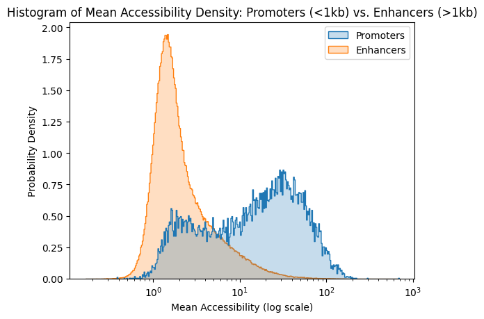

---

To analyze the differences in variability, we employed the Gini coefficient, mirroring the methodology of Yoshida et al. The Gini coefficient is highly robust and particularly advantageous for data that is highly skewed and sparse. Furthermore, its scale independence makes it an ideal metric for assessing variability in ATAC-seq data, which is why we applied it here and throughout our subsequent downstream analysis. 

??? Mot always used

Comparing the two regulatory elements, we successfully replicated the finding that enhancers display substantially higher variability in accessibility across cell types than promoters.

  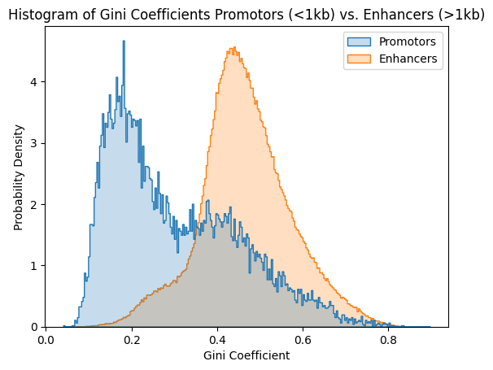

### Continuous Relationship with Gene Distance

We also observed a continuous relationship between the distance to the nearest gene and both the standard deviation (SD) and mean of the ATAC-seq signal. 

While the previous sections focused on the categorical dichotomy between promoters and enhancers, we next investigated whether these signal dynamics follow a continuous relationship relative to the exact genomic distance to the nearest gene. 

Our analysis reveals a continuous correlation between gene distance and both the variability (SD) and mean of the ATAC-seq signal:

#### A. Variability (Gini Coefficient) vs. Distance
The further the Open Chromatin Regions (OCRs) are located from the nearest gene, the higher their continuous variability (measured via the Gini coefficient) becomes.
* **Correlation coefficient:** 0.242
* **Significance ($p$-value):** < 0.001

  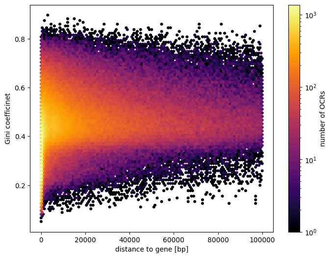

---

#### B. Mean Accessibility vs. Distance
Conversely, we observed a continuous inverse relationship regarding chromatin accessibility: the greater the distance between the OCRs and the nearest gene, the lower their mean accessibility.
* **Correlation coefficient:** -0.287
* **Significance ($p$-value):** < 0.001

  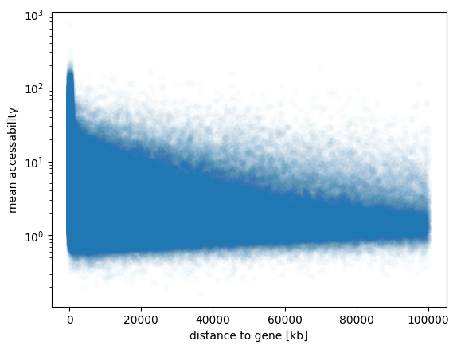

### Signal Variability between different genomic regions

In this phase of the analysis, we investigated whether Open Chromatin Regions (OCRs) localized within distinct genomic features (introns, exons, or intergenic regions) exhibit systematic differences in their ATAC-signal morphology. 

Our initial exploratory analysis revealed a distinct pattern for exonic OCRs compared to intronic and intergenic regions, particularly regarding their **variability**:

  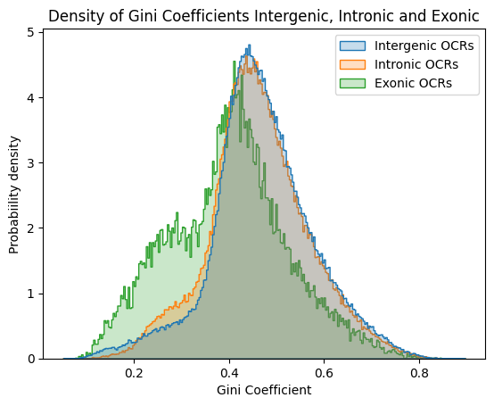

A similar divergence was observed for their **mean accessibility**: 

  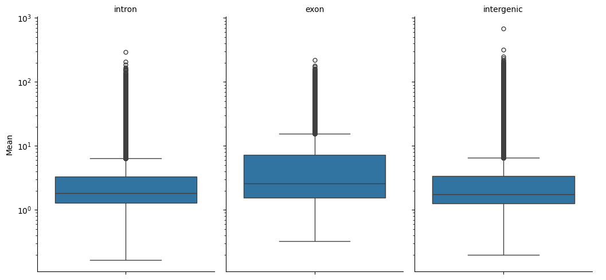

#### Controlling for Confounding Factors

Upon closer inspection, we identified a substantial confounding variable: the distance from OCRs to their nearest  gene body varied drastically between the three subgroups:

  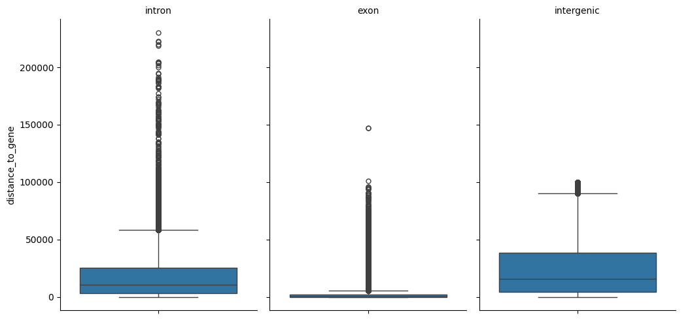

Given our previous finding that genomic distance heavily modulates the ATAC-seq signal profile, this baseline discrepancy introduced a significant bias. To isolate the true effect of the genomic regions, we implemented a distance-matching algorithm. For each exonic OCR, we selected an intronic and an intergenic counterpart with an equivalent distance to the nearest gene. 

Following this correction, the previously observed differences between the three subgroups were no longer statistically significant:

  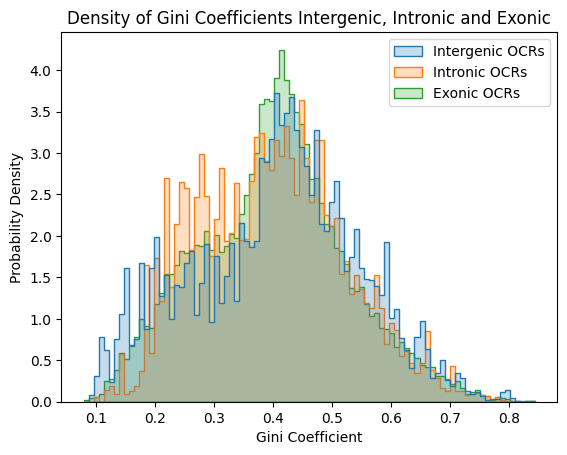

  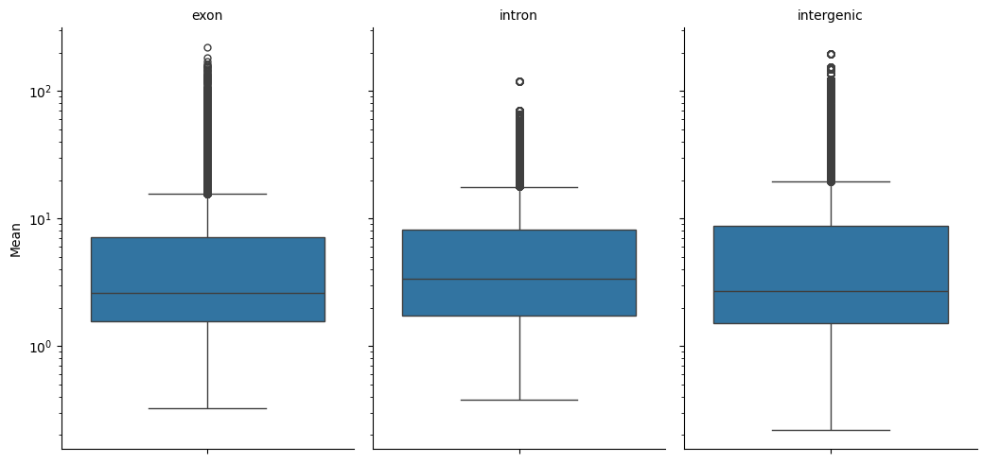

## Cell Type Clustering
Driven by the assumption that OCR accessibility should be similar across closely related cell-types, we performed clustering of our cell types based on their specific ATAC-seq readouts. 
As a form of dimensionality reduction we utilized principle component analysis (PCA). Qualitative visual inspection showed that preselection of only the 90% quantile of OCR variance yieled clusters more congruent with cellular lineage families.

  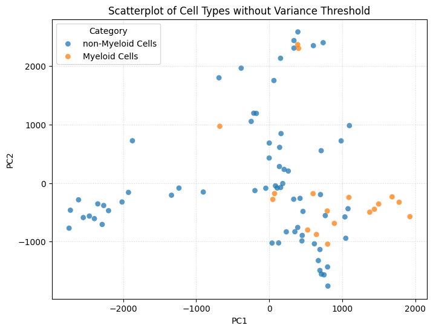

  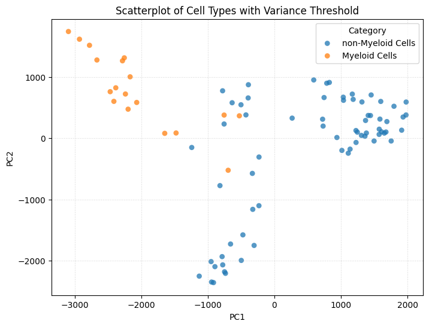

K-means clustering is already able to construct clusters, distinguishing myeloid cells, stem and progenitor cells, B-cells, and T-cells with fairly high accuracy. 

  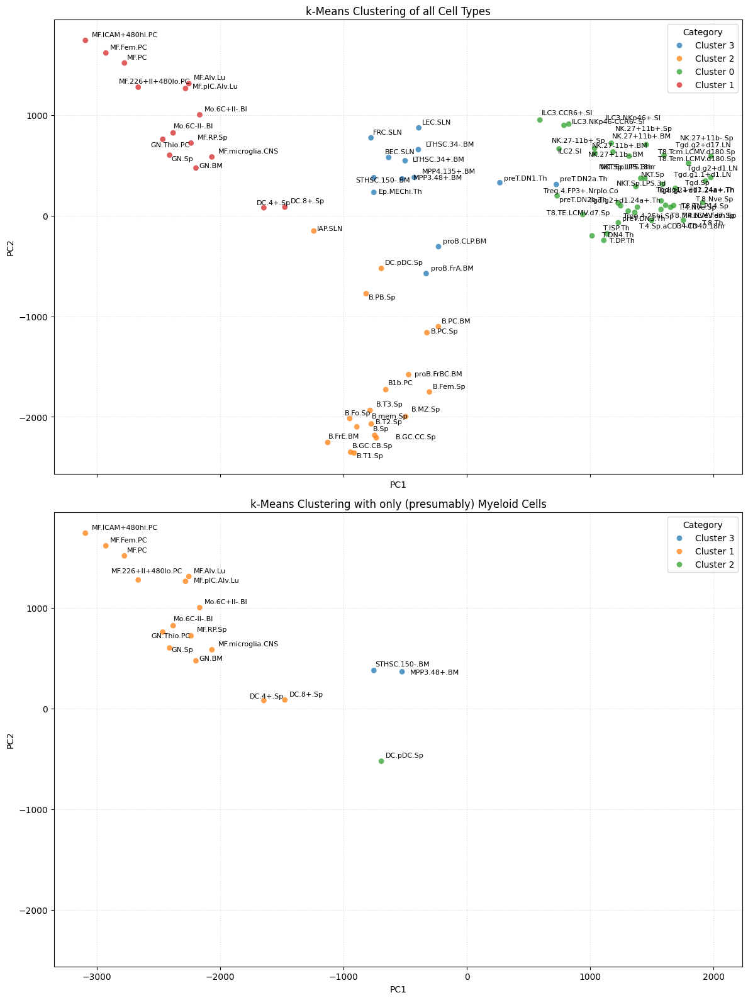

With the exception of plasmacytoid dendric cells (DC.pDC.Sp), multipotent progenitors of the myeloid line (MPP3.48+.BM) and short-term hematopoietic stem cells (STHSC.150-.BM) all cells we initially included in our category of "Myeloid Cells" are part of a single cluster with no other cells present. 

Hierarchical clustering provides a more fine-grained approach for grouping cell types and visualizing structure in the multidimensional PC space. After comparing different linkage methods, distance metrics, and numbers of clusters using silhouette-score analysis and qualitative comparison with k-means clustering, we selected correlation distance with average linkage for the final clustering. This parameter combination achieved the highest average silhouette score and also matches the strategy used by Yoshida et al. for their analysis of the myeloid lineage. Overall, clustering results were fairly robust across different metrics and linkage methods, especially for low numbers of clusters.

  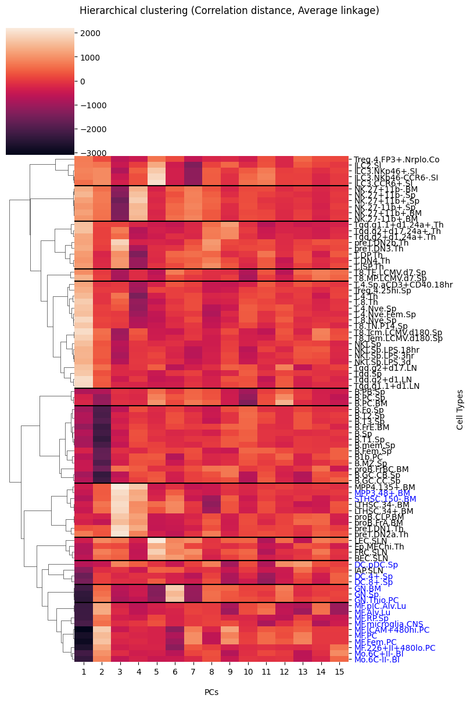

Remarkably, most of the clusters correspond to meaningful biologically distinct groups of cells. With the exception of pericytes (IAP.SLN) all differentiated myeloid cells are sorted into three subclusters, corresponding to dendritic cells (DCs), granulocytes (GNs), and macrophages (MFs) and monocytes (Mos). Additionally, we categorized plasmacytoid DCs as an individual cluster, because of separate position within k-means Clustering and their categorization as a single cell cluster in many other clustering configurations.

## CRE Classification
Two methods were utilized to identify OCRs specifically associated with myeloid cells: Clustering methods, clustering a subset of the OCRs and analysis of the loadings of our PCs that successfully segregated the cell types into biologically meaningful clusters.
### CRE Classification by clustering
To reduce biological noise and keep computational load at a reasonable level, we tested multiple strategies to preselect informative OCR subsets. While selection based on variance and ANOVA F-statistics did not yield clearly interpretable OCR clusters, selecting the top OCRs by Gini coefficient produced more coherent clustering results. We therefore used the top 90% quantile of OCRs ranked by Gini coefficient for further analysis.

Initial attempts to cluster OCRs directly based on accessibility across individual cell types, or in PCA spaces derived from these individual cell-type profiles, did not result in stable or biologically interpretable cluster structures. However, the preceding cell type clustering analysis showed that related cell types grouped together in OCR-based PCA space, indicating that OCR accessibility variation is organized along broader lineage-associated axes. We therefore used this observation to construct a biologically informed dimensionality reduction for OCR clustering.

Instead of representing each OCR by its accessibility across all individual cell types, we aggregated closely related cell types into lineage-level groups corresponding with the derived clusters and calculated the mean accessibility of each OCR within each group. This transformed each OCR into a lower-dimensional lineage-level accessibility profile. This approach preserves major biological accessibility patterns while reducing noise from individual cell-type variation and avoids forcing OCR clustering in a high-dimensional representation that did not yield interpretable results.

After using silhouette-analysis to determine suitable numbers of clusters and visual inspection of corresponding heatmaps, we chose 8 as the appropriate number of clusters. A heatmap of the cluster centroids and their mean accessibility within each group showed that certain centroids can be associated with distinct biologically meaningful groups of cells. E.g. centroids 1 and 5 correspond to most myeloid cells and centroid 4 appears to consist of OCRs particularly accessible in plasmacytoid DCs. 

  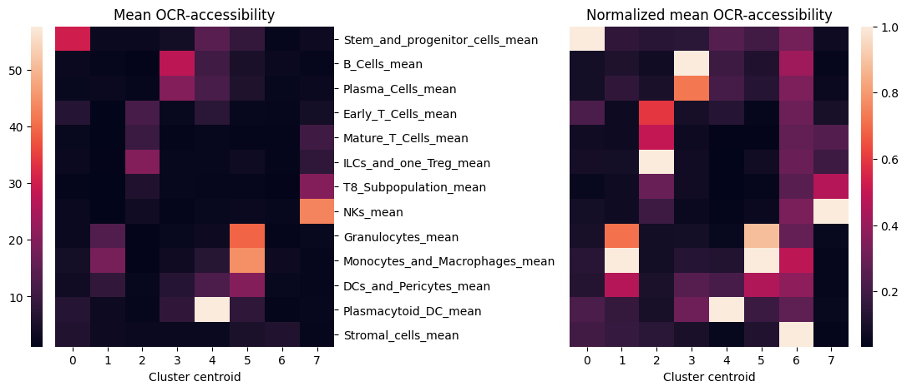

To verify the biological consistency and robustness of this clustering approach, we compared it to hierarchical clustering methods using the same dimensionality reduction technique and number of clusters. For instance average linkage with correlation distance also produced a heatmap where centroids are clearly overly accessible in certain subgroups of cells.

  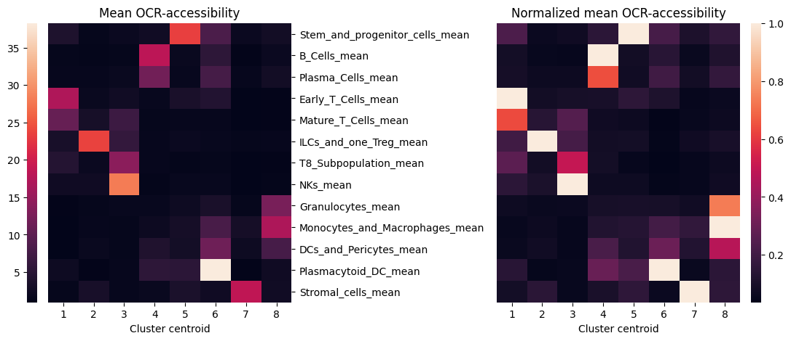

The cluster indices assigned by k-means and hierarchical clustering are arbitrary and therefore not directly comparable. To compare both approaches, we reordered the cluster centroids such that the total correlation distance between matched centroids was minimized.

After this alignment, most centroids from one method could be matched to a highly similar centroid from the other method. This is visible in the correlation distance matrix, where the main diagonal mostly contains values close to 0. Since a correlation distance near 0 indicates strong positive correlation, this suggests that both clustering approaches recovered largely consistent centroid patterns.

  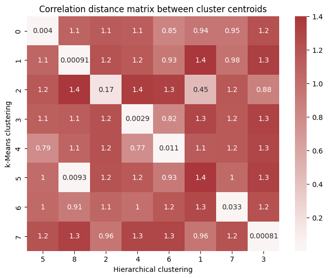

The exceptions to this general trend can also be explained relatively straightforward way. K-means clustering produced two centroids with increased accessibility in myeloid cells (clusters 1 and 5). In contrast, hierarchical clustering yielded only one cluster representing this specific pattern (cluster 8.) This explains the high correlation between k-means cluster 5 and hierarchical cluster 8.

The lack of strong positive correlation for the sixth element on the main diagonal is also interpretable. In this case, the value of 0.45 in the same column would be the most appropriate match for the diagonal. This reflects a difference in how the two methods separated lymphoid-associated patterns: k-means produced a single cluster (2) covering both T cells and ILCs, whereas hierarchical clustering separated these into cluster 1 for T cells and cluster 2 for ILCs.

Based on these results, we selected k-means clusters 1 and 5 and hierarchical cluster 8 as OCR sets potentially relevant for myeloid differentiation. In addition, we selected k-means cluster 4 and hierarchical cluster 6, both of which showed particularly high accessibility in plasmacytoid DCs, to further investigate the unusual behavior of this cell type compared with other differentiated myeloid cells.

Finally, we assessed the quality of our OCR selection by testing whether the selected OCRs showed increased accessibility in the corresponding cell group, either myeloid cells or pDCs, compared with all other cell types. For each OCR, we calculated the row-wise z-transformed mean accessibility difference between the cell group of interest and all remaining cell types. We then compared this effect distribution between selected OCRs and all non-selected OCRs.

  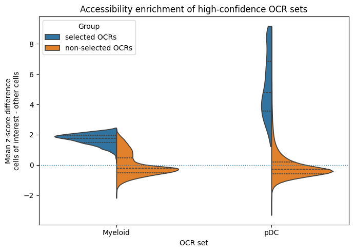

### CRE Classification by PCA loading analysis
#ToDo
Only elaborate, if the specific rankings for DCs, Granulocytes and Macrophages & Monocytes actually yield useful results later

## Constistency between Modalitites

Cell types distinguish in morphology and function. The differences are a result of individual gene expression patterns in every cell. Thus, we assumed that cells can be not only clustered in related groups by using OCR accessibility but also by applying their gene expression. Our goal was to later use the resulting cell lineage to compare it with the results of the previous cell clustering and with the cell lineage tree from Yoshida et al.

Data exploration revealed that only a fraction of the 17.535 genes differ significantly from 0 in their mean and variance value.Therefore, analysis was based on the top 10 % of the most variable genes in the RNA-seq dataframe. We used Principle Component Analysis to reduce the dimensions of the dataset, keeping the Principle Components that explain 95% of the variance across cells.

??? PICTURE like in 1.3

Firstly, k-means clustering was applied to separate the cells in distinct clusters. By calculating the silhouette-score per number of clusters, promising numbers of clusters were used to separate group 5 cells from other cells. Already k=2 formed one cluster exclusively containing myeloid cells. Only progenitor and dendritic cells were linked to the other cluster.

  

Next, we performed hierarchical clustering to create a dendrogram that reveals the cell lineage relationships. By calculating the average silhouette score, different distance metrics and linkage methods were compared. The best results were achieved by using the distance metric correlation and the linkage method average. Moreover, the linkage tree was cut into k=11 clusters, which lead to the best separation of cells into distinct groups.

  

When comparing the dendrogram of cell clustering based on OCR accessibility and gene expression, high similarity is seen. Myeloid cells are separated into a macrophage and monocyte cluster, a granulocyte cluster, and a dendritic cell cluster. The progenitor cells do not cluster with the matured myloid cells.
Compared to the lineage tree provided by Yoshida et al. it is remarkable that the tissue-dependent macrophages cluster well in our approach, whereas they are excluded in the paper due to different behaviour. On the other hand, progenitor cells in the paper are linked closely to the matured myeloid cells. Otherwise, the lineage tree provided in the paper is mostly similar regarding the myloid cells. This support the validity of our cell clustering approach.

---

## Gene Expression Patterns

Clustering genes based on cell expression turned out to be not as straight forward as clustering cells based on gene expression. Because of the high amount of genes, we used the 10 percentile of most variable genes, determined with the gini coefficient, to reduce the gene number and improve the significance of gene clustering. 

Clustering genes based on the expression across the 86 immune cells as well as on the prinicple components explaining 95% of variance did not result in valid clusters. Therefore, we aggregated the cells in clusters based on cell clustering by gene expression. This was performed by calculating the mean gene expression across the 11 cell groups.

Next, gene expression needed to be z-transformed across cell groups, so that the difference in expression levels did not disturb the analysis.

We used k-means clustering and calculated the silhouette score to determine the best amount of clusters. For k=10 and k=11 we visualized the gene expression of cell groups in different centroids.

  

To biologically confirm the meaningful separation of genes into clusters, we performed gene ontology enrichment analysis to determine if the clusters show particular biological functions. With k=11, all clusters beside cluster 4 and 5 expressed significant enrichment in distinct biological functions. The enriched biological functions of each cluster can be linked to the cell groups that showed high gene expression in this centroids.

  

The genes which were part of the clusters with high gene expression level across myeloid cells were stored for later analysis. 

Another approach to determine lineage-sepcific genes is to compare the difference in mean expression of myeloid genes compared to other genes after z-transformation. We further investigated the top 250 genes with the highest difference by gene ontology enrichment analysis. The resulting biological functions match myeloid specific gene sets. 

  

--- 

## CRE–Gene Association via Correlation

### Integration of ATAC-Seq and RNA-Seq Signals

To functionally link chromatin accessibility with transcriptional output, we performed a Spearman correlation analysis across all OCR-gene pairs identified within a 100 kb window (derived from the `genes.within.100kb` annotation). $P$-values were adjusted for multiple testing using the Benjamini-Hochberg false discovery rate (FDR) correction, applying a significance threshold of $\text{FDR} < 0.05$.

These significantly correlated pairs served to identify myeloid-lineage-specific OCRs. Specifically, we filtered for significant OCRs associated with the lineage-specific marker genes established in Section 2.1. These regulatory regions subsequently formed the foundation for the transcription factor binding motif (TFBM) analysis detailed in Section 3.0.

#### Spatial Analysis of OCR-Gene Correlations

We observed a weak but highly significant inverse relationship between the correlation coefficient of an OCR-gene pair and the genomic distance separating them:

* **Spearman's $\rho$:** -0.087
* **Significance ($p$-value):** $< 0.001$

  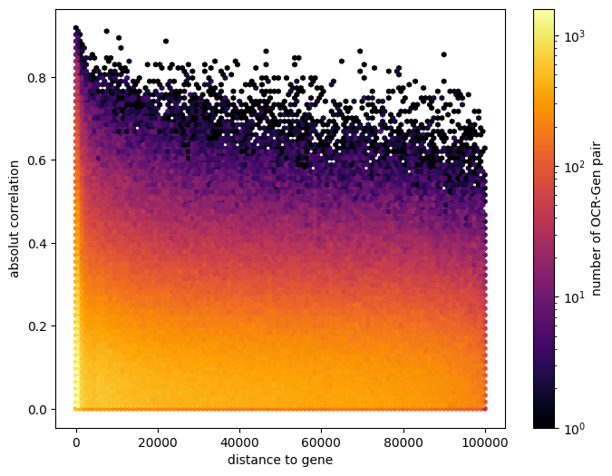

Interestingly, approximately 25% (one-quarter) of all significantly associated OCR-gene pairs exhibited a negative correlation. 

To investigate these negatively correlated pairs further, we tested the hypothesis that negative correlations within proximal promoter regions ($<1\text{ kb}$ from the TSS) might be driven by nucleosome positioning or phased histones displaced by chromatin remodeling complexes. Under this hypothesis, we expected to observe a periodic pattern in correlation strength relative to the distance within the $1\text{ kb}$ window. However, no such periodicity was detected:

  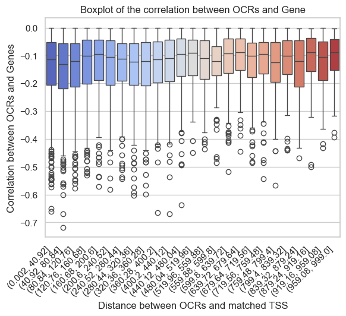

#### Regulatory Complexity: Degree of Many-to-Many Interactions

Finally, we quantified the regulatory complexity by assessing the number of significant connections per genomic feature. Our results indicate a many-to-many regulatory architecture: a typical gene significantly correlates with approximately 10 distinct OCRs:

  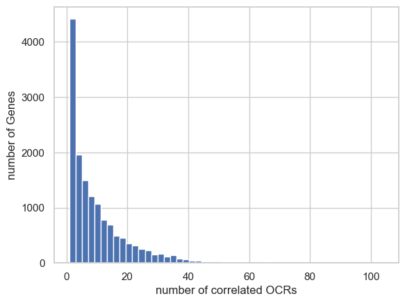

Conversely, a typical OCR significantly correlates with an average of 1.4 genes: 

  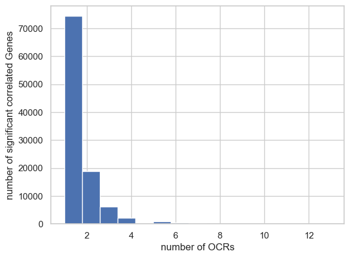

## CRE–Gene Association via Regression
### Upper estimate using Ordinary Linear Regression

cool plot I wanna talk about

  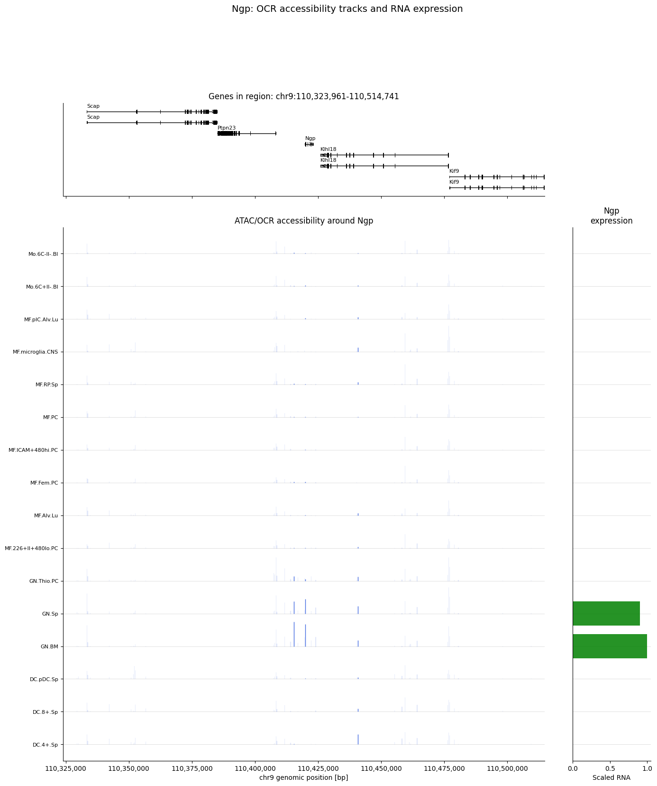

## Transcription Factor Activity
We performed an analysis of transcription factor (TF) binding motifs in open chromatin regions (OCRs).
TF analysis provides insight into which transcription factors are likely controlling the genes and cell states observed in the data.
### Connecting ATAC-seq peaks and the TF-Matrix
We connected the TF motif data with the ATAC‑seq dataset by matching both DataFrames through their shared peak identifiers. The TF motif file contained motif hits indexed by simple integer peak IDs, while the ATAC‑seq table used full peak names such as "ImmGenATAC1219.peak_123". To make both formats compatible, we first converted the integer peak IDs from the motif file into the ATAC naming scheme by prefixing them with "ImmGenATAC1219.peak_".

We then set the ATAC‑seq peak ID column as the index and performed an inner merge between the motif table and the ATAC‑seq table. This merge produced a combined dataset in which each TF motif hit was directly linked to the corresponding ATAC‑seq peak and its associated metadata.

This merged table served as the basis for all subsequent steps.

### Connecting RNA-seq Data with the TF-Matrix
Since these two dont have a common column, we use the merged ATAC-TF DataFrame. We  loaded the RNA‑seq dataset and then the ImmGen-ATAC‑seq gene‑association file, which links each peak to one or more nearby genes. Since a single peak can be associated with multiple genes, we split the gene lists into individual entries and used explode() to create one row per peakID–gene_name pair. This resulted in a clean peak‑to‑gene mapping table (df_cre_gene_assoc).

With the peak‑to‑gene associations prepared, we merged them with the TF motif table. The motif table contained motif hits per peak, and by joining it with the exploded peak‑to‑gene mapping, each motif hit became directly linked to the genes associated with that peak. We then grouped this merged dataset by gene_name and motif_name to compute motif counts and summary statistics (maximum and mean motif scores). This produced a compact table describing TF motif activity per gene.

Finally, we merged this aggregated TF–gene table with the cleaned RNA‑seq expression matrix. The result combines gene expression values with TF motif information, enabling downstream analyses that relate transcription factor binding patterns to gene expression profiles

  

Ich glaube hier wäre ein Bild praktisch, leider hab ich keine Plots

### Interpretation of the merged DataFrames
Using previously determined cell-lineage specific OCRs and genes, we were able to filter for all binding motifs of our interest. We then determined TF-binding motives that (hier ist mir aufgefallen, dass ich nirgends geschaut hab, ob unsere Motifs in andere Zelltypen signifikant weniger auftauchen) are important to myleoid cell diffentiation by combining the number of times a specific binding motif was found connected to a (hier ist mir aufgefallen, dass man die Listen für maximale biologische Aussagekraft einfach kombinieren sollte) myleoid associated OCR or gene and the average binding strength (das wäre in der tat sehr sinnvoll das zu tun).

---
## Highlights
<!--  -->
